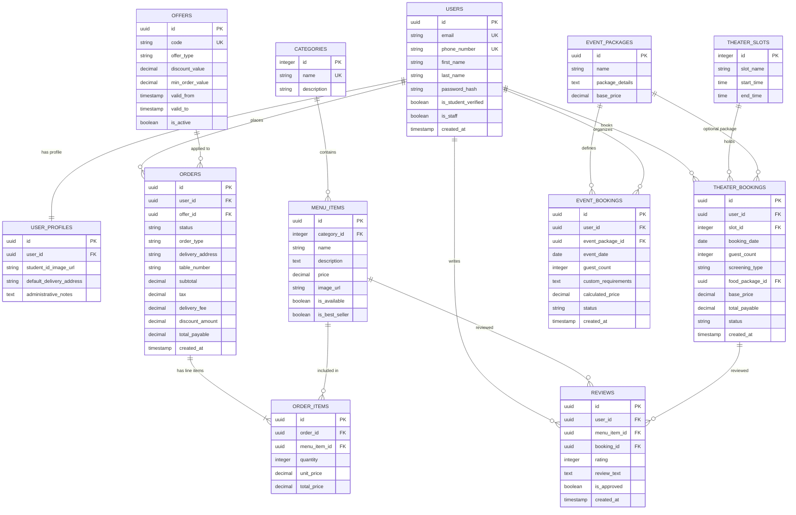

# Project Understanding: Midnight House

This document provides a comprehensive overview of the **Midnight House** platform, synthesizing the Product Requirement Document (PRD), Technical Architecture Specification, Backend Django Architecture Spec, Development Roadmap, and Sprint 1 Implementation details.

---

## 1. Project Summary

**Midnight House** is a premium, cozy, private-experience cafe located in **Scheme No. 74, Vijay Nagar, Indore**. Operating under the tagline **"Your Own Private Space,"** it is designed specifically for students and friend groups who seek exclusive private environments rather than conventional, noisy public cafe layouts.

The business model relies on three key revenue drivers:
* **Private Mini Theater**: A premium room with a maximum capacity of 8 patrons, bookable in fixed 3-hour slots for movie screenings, IPL matches, birthdays, or private gatherings.
* **Customizable Event Packages**: Birthday and farewell celebration packages designed for groups up to 10 guests.
* **Premium Food & Beverage Catalog**: High-quality dine-in table service and localized home delivery within a strict 5 KM radius.

---

## 2. Business Goals

The digital platform is engineered to drive business growth through three core vectors:

1. **More Orders**: Streamlining the food ordering process for both Dine-in Table Service and local Home Delivery.
2. **More Customers**: Attracting and retaining new patrons via targeted marketing campaigns, student discounts, and social proof.
3. **More Bookings**: Maximizing the occupancy of the Private Mini Theater and Event packages through an automated, real-time, double-booking-proof reservation system.

### Objectives & Key Results (OKRs)

* **Objective 1: Maximize Private Theater Occupancy**
  * *KR 1.1*: Maintain > 85% occupancy rate during prime weekend slots (5:00 PM – 11:00 PM).
  * *KR 1.2*: Increase repeat theater bookings to 30% month-over-month.
* **Objective 2: Scale Food & Beverage Delivery and Dine-in Revenue**
  * *KR 2.1*: Increase daily delivery volume by 40% through local SEO and 5 KM radius optimization.
  * *KR 2.2*: Grow average customer spend from ₹200 to ₹350 by introducing cross-sold theater food packages.
* **Objective 3: Streamline Operations & Automation**
  * *KR 3.1*: Achieve zero double-bookings or overlapping slot issues.
  * *KR 3.2*: Reduce order-to-table delivery time for dine-in to less than 15 minutes via the digital kitchen display system.

---

## 3. User Roles

To maintain transactional integrity and prevent spam bookings, **anonymous guest bookings/orders are strictly prohibited**. The platform defines two explicit authenticated roles with access privileges managed by a granular access control matrix:

### 3.1 Customer (Authenticated)
* **Self-Signup / JWT Sessions**: Authenticated via OTP-based or password-based secure credentials.
* **Browse & Order**: Browse the digital food catalog, manage their shopping cart, and place orders (Home Delivery up to 5 KM or Dine-in Table Service).
* **Reservation Engine Access**: View the interactive calendar, book Private Theater slots, select optional add-on food packages, and reserve Birthday/Farewell event slots.
* **Verification Drawer**: Upload student ID cards for admin verification to unlock special student discount rates.
* **Verified Reviews**: Leave 1-to-5 star ratings and written reviews only for menu items they have actually purchased or slots they have booked.
* **Profile Dashboard**: Manage saved delivery addresses, track real-time order preparation states, and view complete booking/order history.

### 3.2 Admin (Authenticated / Staff)
* **Inventory & Catalog Control**: Instantly create, edit, toggle availability, adjust pricing, or upload media assets (via Cloudinary CDN) for menu items.
* **Order & Slot Controller**: Live Kanban board of active kitchen preparation and delivery dispatch states, with capabilities to override, cancel, or manually block out slots for cleaning/VIP bookings.
* **Campaign Manager**: Design and configure promotional coupons (flat/percentage discounts), define usage restrictions (e.g. min spend, student-only), and update homepage banners.
* **System Analytics**: Visual dashboard tracking daily gross sales, busiest slot patterns, active orders, and customer acquisition metrics.
* **Customer Directory & Approvals**: Review student verification documents, approve student profiles, and moderate or respond to customer reviews.

---

## 4. Core Features

### 4.1 Identity & Profile Services
* **Secure Auth Pipeline**: JWT authentication with refresh token rotations stored in secure, HTTP-only, SameSite cookies.
* **Student Verification Pipeline**: User-facing document upload portal in their profile dashboard, paired with administrative review queues.

### 4.2 Digital Food Catalog
* **Dynamic Menu Grid**: Interactive, responsive display categorized into *Tea, Coffee, Maggie, Burger, and Pasta*.
* **Aesthetic Visual Badges**: Fast identification of Best Sellers, Vegetarian/Non-Vegetarian items, allergen flags, and preparation times.

### 4.3 Unified Ordering Engine
* **Real-time Cart**: Automatic subtotal, tax, delivery fee, and discount coupon calculations.
* **Delivery Routing Boundaries**: Local delivery logic checking physical coordinates using the Haversine distance formula to enforce the 5.0 KM limit.
* **Live Order Tracking**: Customer-facing status progression (Received $\rightarrow$ Preparing $\rightarrow$ Ready to Serve / Out for Delivery $\rightarrow$ Completed).

### 4.4 Theater & Event Reservation Engine
* **Interactive Calendar Grid**: Real-time availability indicator mapping the strict two-slot fixed daily schedule:
  * **Slot A**: 05:00 PM – 08:00 PM (3 Hours)
  * **Slot B**: 08:00 PM – 11:00 PM (3 Hours)
* **Customization Add-ons**: Headcount selectors (capped at max 8 patrons) and screening types (Movie, IPL, Birthday, Friends Gathering) integrated with food package upsell menus.
* **Event Booking Interface**: Booking forms for Birthday Parties (Basic/Premium) and Farewell Parties (capped at max 10 guests).

### 4.5 Admin Command & Control
* **Kitchen Kanban Board**: Real-time display for kitchen staff to manage order states.
* **Slot Blockout Utility**: Quick-override tool to schedule deep cleaning or private VIP bookings.
* **Cloudinary Media Storage**: Automated cloud image optimization and asset hosting.

---

## 5. Database Overview

The system uses a highly normalized PostgreSQL schema designed to guarantee absolute transactional consistency. All models (except lookup directories like `CATEGORIES` and `THEATER_SLOTS`) utilize **UUIDs** as primary keys to prevent resource enumeration attacks and protect business metrics.

### Database Entity-Relationship Summary



---

## 6. API Overview

All API endpoints are structured under version control (`/api/v1/`) and implement clean REST principles using Django REST Framework (DRF).

### 6.1 Authentication & Profile
* `POST /api/v1/auth/register/` *(Public)*: Registers a new customer profile.
* `POST /api/v1/auth/login/` *(Public)*: Validates credentials and sets secure, HTTP-only `access_token` and `refresh_token` cookies.
* `POST /api/v1/auth/logout/` *(Auth Required)*: Clears the secure auth cookies.
* `POST /api/v1/auth/student-verify/` *(Auth Required)*: Accepts multi-part student ID image uploads for admin evaluation.
* `POST /api/v1/auth/token/refresh/` *(Public)*: Rotates access and refresh tokens via secure cookies.

### 6.2 Catalog Services
* `GET /api/v1/catalog/categories/` *(Public)*: Returns a listing of available food categories.
* `GET /api/v1/catalog/items/` *(Public)*: Returns available menu items grouped by categories with filters.
* `POST /api/v1/catalog/items/` *(Admin Only)*: Creates new menu items.

### 6.3 Ordering Services
* `POST /api/v1/orders/calculate-fee/` *(Auth Required)*: Submits delivery coordinates to verify the 5 KM radius limit and returns calculated fees.
* `POST /api/v1/orders/checkout/` *(Auth Required)*: Places a finalized dine-in or delivery order.
* `GET /api/v1/orders/history/` *(Auth Required - Owner/Admin)*: Retrieves chronological transaction histories.

### 6.4 Reservation Services
* `GET /api/v1/theater/slots/?date=YYYY-MM-DD` *(Public)*: Displays Slot A and Slot B availability states for a given date.
* `POST /api/v1/theater/bookings/` *(Auth Required)*: Reserves a slots. Implements server-side concurrency checking.

### 6.5 Administrative Control
* `GET /api/v1/admin/analytics/dashboard/` *(Admin Only)*: Returns aggregated operational statistics and sales metrics.
* `POST /api/v1/admin/slot-lock/` *(Admin Only)*: Manually overrides or blocks slots.

---

## 7. Django Architecture Overview

The backend uses a **modular monolithic architecture** combined with a **Service Layer (Domain-Driven Design Lite)** pattern to enforce clean Separation of Concerns (SoC).

```
┌────────────────────────────────────────────────────────┐
│                      Request Flow                      │
│                                                        │
│ Client ──> View (Route/Auth) ──> Serializer (Validate) │
│                                      │                 │
│                                      ▼                 │
│                    Service Layer (Business Rules)      │
│                                      │                 │
│                                      ▼                 │
│                     Database (SELECT FOR UPDATE)       │
│                                      │                 │
└────────────────────────────────────────────────────────┘
```

### 7.1 Key Architecture Strata
* **Skinny Views & ViewSets**: Responsible purely for HTTP routing, request parsing, authentication/permission scoping, and returning structured JSON.
* **Skinny Models**: Retained strictly as normalized tables representing database states.
* **Cohesive Serializers**: Conduct strict validation, sanitization, and data parsing. They do not write to the database.
* **Service Layer (`services.py` modules)**: The domain logic layer. All operational business rules (e.g., checkout distance checks, slot validation, discount adjustments, and transactions) reside within static service methods.
* **Database Transactions (`transaction.atomic()`)**: All actions mutating multiple database entities are enclosed in transactions to avoid partial writes.
* **Granular Permissions**:
  * `IsAdminOrReadOnly`: Permits public reads, limits writes to staff.
  * `IsVerifiedStudent`: Grants access exclusively to verified student profiles.
  * `IsOwnerOrAdmin`: Validates that the requesting user owns the object or is a staff member.

---

## 8. Development Roadmap Summary

The engineering plan is structured into **6 distinct, 2-week sprints** spanning a **12-week total timeline**:

```
                                  Timeline (Weeks)
   0         2         4         6         8         10        12
   ┌─────────┬─────────┬─────────┬─────────┬─────────┬─────────┐
   │Sprint 1 │Sprint 2 │Sprint 3 │Sprint 4 │Sprint 5 │Sprint 6 │
   └─────────┴─────────┴─────────┴─────────┴─────────┴─────────┘
   Foundation  Catalog     Theater    Promo &    Admin    Testing &
     & Auth   & Orders    Bookings    Reviews   Console    Launch
```

### Sprint Summary
* **Sprint 1: Foundations & Auth Pipeline**: Scaffold repository, configure PostgreSQL local connection, establish Django app structure, and code secure JWT cookie auth.
* **Sprint 2: Catalog & Basic Cart Engine**: Code `catalog` and `orders` schemas, implement the spatial boundary check using the Haversine formula, and build responsive frontend catalog and checkout page views.
* **Sprint 3: Mini-Theater & Event Reservation Engine**: Model reservation structures, configure transactional limits, develop thread-safe slot allocations, and build the interactive calendar component.
* **Sprint 4: Marketing Campaigns, Offers, & Review Pipeline**: Build promotional coupon validation engines, student verification modules, and verified review workflows.
* **Sprint 5: Admin Command Center & Kitchen Display**: Configure Cloudinary media handlers, build administrative analytics queries, and implement real-time kitchen Kanban displays using Django Channels (WebSockets) or SSE.
* **Sprint 6: Optimization, Integration Testing, & Launch**: Execute production builds, integrate local SEO tags, run stress testing under concurrent user simulations, configure Nginx SSL proxies, and orchestrate Docker multi-stage deployments.

---

## 9. Missing Information

During our architectural audit of the PRD and roadmap documents, several critical gaps were identified. These points represent business and design decisions that should be resolved before starting the respective sprint phases:

### 9.1 Theater Booking Fees & Financial Workflows (Sprint 3)
* **Gaps**: Hourly cost of the Private Mini Theater is not specified. It is unclear if slot rates vary between weekdays and weekends, or if specific screening types (e.g. IPL vs Movie) carry premiums.
* **Payment Flow**: The initial roadmap does not specify when booking fees must be settled. If booking a slot utilizes online payment, we must define integration targets (e.g. Razorpay/Stripe). If Pay-at-Cafe is used, we require mechanisms to prevent fake reservations from spamming and exhausting slots.

### 9.2 Event Packages Pricing & Inclusions (Sprint 3)
* **Gaps**: Exact package details for "Basic" vs "Premium" Birthday and Farewell offerings are undefined.
* **Scope**: We must outline if Event Packages automatically include Private Theater rental, or if the theater booking is an independent checkout item.

### 9.3 Swiggy & Zomato Integration Logic (Sprint 2 / Sprint 5)
* **Gaps**: The PRD outlines using third-party apps for customers outside the 5 KM delivery radius. It is unclear if this involves programmatic integrations (updating Swiggy/Zomato menu inventories via merchant partner APIs) or simply redirecting out-of-range customers to the cafe's Zomato/Swiggy shop links.
* *Architect's Recommendation*: Deep programmatic menu integration requires verified partner merchant API credentials. A simple, robust initial implementation is to display direct external links for out-of-bounds addresses.

### 9.4 Menu Itemization & Customizations (Sprint 2)
* **Gaps**: Menu item categories are defined (*Tea, Coffee, Maggie, Burger, Pasta*), but specific product customizations are not listed (e.g., cheese toppings, double patties, portion size adjustments). The database schema must be aligned with these configurations before Sprints 2.

### 9.5 Daytime Slot Availability & Schedule Clashes (Sprint 3)
* **Gaps**: Slots are strictly limited to Slot A (5 PM - 8 PM) and Slot B (8 PM - 11 PM). The daytime status (12:00 PM – 5:00 PM) of the theater room is not documented.
* **Schedule Overrides**: Sports matches (like IPL) or special events frequently clash with standard slot windows (e.g., a match starting at 7:30 PM). We need to decide if the admin dashboard should support dynamic override timing shifts, or if timings are hard-locked.

---

## 10. Risks and Recommendations

### 10.1 Double-Booking Race Conditions
* **Risk**: High-concurrency events (e.g., major cricket matches or holiday slot releases) can result in multiple users checking out the same slot simultaneously, causing double bookings and customer dissatisfaction.
* **Recommendation**: Implement **Pessimistic Row-Level Locking** (`select_for_update()`) in PostgreSQL during the slot verification transaction block in the Service Layer. This serializes write attempts and returns clean `409 Conflict` HTTP errors for overlapping checkout attempts.

### 10.2 Geolocation boundary checking
* **Risk**: Users sitting at the boundary edge (e.g. 5.05 KM) might experience fluctuating address resolutions, blocking their checkout. Repeated distance calculations can also inflate Google Maps API bills.
* **Recommendation**: Cache calculated distance records mapped to specific addresses. Implement a soft-warning threshold starting at 4.7 KM to alert users they are near the limits, and provide a small 100-meter grace error margin on the server side to handle location offsets.

### 10.3 Menu Out-of-Stock during checkout
* **Risk**: A customer adds an item to their cart, but during checkout, the item goes out of stock in the physical kitchen.
* **Recommendation**: Re-verify database item availability (`is_available` states) inside the checkout transaction block (`POST /api/v1/orders/`). If an item is marked out of stock, cancel execution, return a `422 Unprocessable Entity` status, and prompt the frontend to alert the user to substitute the item.

### 10.4 Administrative Credential Hijacking
* **Risk**: Admin dashboards control inventory, pricing, slot locks, and student records. Credential sharing or weak sessions pose a security risk.
* **Recommendation**: Enforce rigid session expiration rules (JWTs valid for max 7 days), restrict administrative access to specific origin IPs (if on-premise) or enforce Multi-Factor Authentication (MFA), and log all administrative actions to an audit table.

### 10.5 High Latency in Media Loading
* **Risk**: Rendering heavy high-resolution images in the media gallery and menu cards can reduce page speed scores (which must be $\ge 90$).
* **Recommendation**: Leverage Cloudinary's dynamic optimization and resizing query parameters on the frontend. Implement Next.js `<Image />` tags with lazy loading, and use blurred low-resolution image placeholders to improve the visual loading experience.
