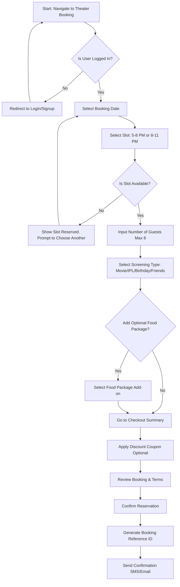
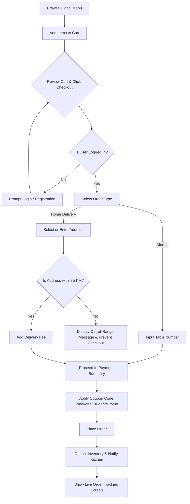
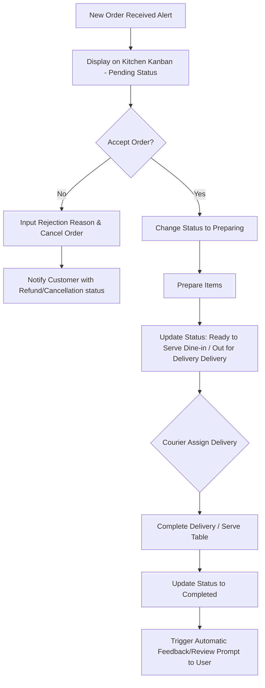
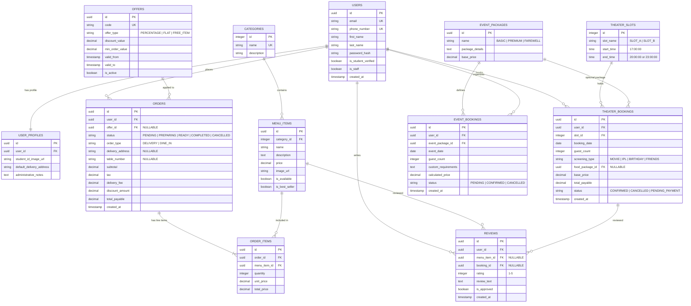

# Midnight House: Your Own Private Space
## Product Requirement Document (PRD) & Technical Architecture Specification

---

## 1. Document Control & Metadata

| Title | Midnight House - Platform Requirements & Architecture Specification |
| :--- | :--- |
| **Version** | 1.0.0 |
| **Status** | Draft for Review |
| **Target Launch** | Q3 2026 |
| **Authors** | Senior Product Manager & Software Architect |
| **Tech Stack** | Next.js, Django, PostgreSQL, Cloudinary, Tailwind CSS, Shadcn UI |

---

## 2. Product Requirement Document (PRD)

### 2.1 Executive Summary & Product Vision
**Midnight House** is a premium, cozy cafe located in Scheme No. 74, Vijay Nagar, Indore. Unlike traditional coffee shops, Midnight House operates under the tagline **"Your Own Private Space."** It caters specifically to students and friend groups who seek not just food and drinks, but private experiences. The primary business drivers are its **Private Mini Theater** (max capacity 8), customizable **Birthday/Event Packages** (max capacity 10), high-quality **Food**, and **Home Delivery** within a 5 KM radius.

The goal of this platform is to drive business growth through three vectors:
1. **More Orders**: Streamlining the food ordering process for both dine-in and home delivery.
2. **More Customers**: Attracting new patrons via target marketing (offers, student discounts, social proof).
3. **More Bookings**: Maximizing the occupancy of the Private Mini Theater and Event packages through an automated reservation system.

### 2.2 Objectives & Key Results (OKRs)
* **Objective 1: Maximize Private Theater Occupancy**
  * *KR 1.1*: Maintain > 85% occupancy rate during weekend slots (5 PM - 11 PM).
  * *KR 1.2*: Increase repeat theater bookings to 30% month-over-month.
* **Objective 2: Scale Food & Beverage Delivery and Dine-in Revenue**
  * *KR 2.1*: Increase daily delivery volume by 40% through local SEO and 5 KM radius optimization.
  * *KR 2.2*: Grow average customer spend from ₹200 to ₹350 by introducing cross-sold theater food packages.
* **Objective 3: Streamline Operations & Automation**
  * *KR 3.1*: Zero double-bookings or overlapping slot issues.
  * *KR 3.2*: Reduce order-to-table delivery time for dine-in to less than 15 minutes via the digital kitchen display system.

---

## 3. User Roles & Access Control Matrix

We define two explicit actors on the platform. To maintain high booking integrity and limit spam, **anonymous guest bookings/orders are prohibited**.

| Module / Feature | Customer Role (Authenticated) | Admin Role (Authenticated) |
| :--- | :--- | :--- |
| **Registration / Login** | Yes (Self signup, JWT session) | Yes (Pre-seeded/Admin created) |
| **Browse Menu & Pricing** | Yes | Yes (Manage items, categories) |
| **Cart & Ordering** | Yes (Dine-in / Delivery) | Yes (View, update status, cancel) |
| **Theater Slot Booking** | Yes (Select slot, add food package) | Yes (Block slots, override bookings) |
| **Event Package Booking** | Yes (Choose Basic/Premium, date) | Yes (Edit packages, review bookings) |
| **Write & Edit Reviews** | Yes (Only for items/bookings ordered) | Yes (Approve, flag, reply to reviews) |
| **Offers & Discounts** | Yes (View and apply coupon code) | Yes (Create, toggle, delete coupons) |
| **Gallery** | Read-Only | Read & Write (Upload via Cloudinary) |
| **System Analytics** | No Access | Read-Only (Dashboard reports) |
| **Customer Directory** | No Access | Read & Write (View, flag profiles) |

---

## 4. Comprehensive Features List

### 4.1 Customer-Facing Features (Web/Mobile Responsive)
* **User Identity**:
  * OTP-based or Password-based Registration and Login.
  * Student validation mechanism (upload student ID card for verification) to unlock the Student Discount.
  * Profile management (name, phone number, saved delivery addresses, past orders, upcoming reservations).
* **Digital Catalog**:
  * Highly interactive menu categorizing Tea, Coffee, Maggie, Burger, and Pasta.
  * Visual indicators for Best Sellers, Vegetarian/Non-Vegetarian, Preparation time, and Ingredients.
  * Detailed item pages with reviews, ratings, and allergen warnings.
* **Ordering Engine**:
  * Real-time cart system calculating subtotal, taxes, delivery charges (based on distance up to 5 KM), and offer deductions.
  * Delivery type selection: "Home Delivery" or "Dine-in Table Service".
  * Real-time order tracking (Received $\rightarrow$ Preparing $\rightarrow$ Out for Delivery / Ready to Serve $\rightarrow$ Completed).
* **Reservation Engine**:
  * Calendar view for the Private Mini Theater showing available and booked slots (5 PM - 8 PM, 8 PM - 11 PM).
  * Booking customization options: Screening type (Movie, IPL, Birthday, Friends Gathering) and headcount input (capped at 8).
  * Food package add-on workflow during booking check-out.
  * Event Booking portal for Birthdays (Basic / Premium packages) and Farewell Parties (capped at 10 guests).
* **Social Proof**:
  * Media Gallery containing categorized photos of Food, Cafe Interior, Theater, Birthdays, and Events.
  * Review system allowing verified customers to leave ratings (1-5 stars) and textual feedback for food and bookings.

### 4.2 Admin-Facing Features (Command & Control Dashboard)
* **Dynamic Analytics**:
  * Live metrics: Today's Revenue, Active Orders, Theater Occupancy Rate, Top Selling Items.
  * Long-term reports: Monthly sales trend, busiest time slots, customer acquisition cohort.
* **Inventory & Menu Control**:
  * Toggle availability of menu items instantly (instantly syncs with frontend).
  * Edit price, descriptions, images, tags, and category associations.
* **Order & Slot Controller**:
  * Live Kanban board of active orders for the kitchen staff.
  * Direct Slot Management: Manual overriding (blocking out slots for maintenance or private VIP sessions).
* **Campaign Manager**:
  * Create discount codes with rules (e.g., Min spend, Weekend active, User-specific, Student-only).
  * Edit banners and landing page announcement bars.

---

## 5. Detailed User Flows

### Flow 1: Private Theater Booking (Customer Journey)


### Flow 2: Dine-in / Delivery Ordering (Customer Journey)


### Flow 3: Order Management & Preparation (Admin Journey)


---

## 6. Strict Business Rules

### 6.1 Authentication & Security
1. **No Guest Bookings/Orders**: Every transactional action requires an verified user account. Guest checkout is blocked to reduce no-shows and coordinate delivery logistics.
2. **Session Validity**: JWT tokens must expire after 7 days. Double-session logins for administrative roles are blocked to prevent credential sharing.

### 6.2 Theater Reservation Protocol
1. **Slot Fixed Schedule**: Midnight House operates exactly two theater slots:
   * **Slot A**: 05:00 PM – 08:00 PM (3 Hours)
   * **Slot B**: 08:00 PM – 11:00 PM (3 Hours)
   No custom slot configurations are allowed.
2. **Buffer / Turnaround Time**: There is a strict 0-minute overlap. However, the system assumes the cafe team cleans the room from 8:00 PM to 8:15 PM; hence, Slot B physical entry is starting at 8:15 PM, which must be clearly specified on the receipt.
3. **Hard Capacity Limit**: Capped at exactly **8 patrons**. No bookings can select more than 8 guests.
4. **Advance Locking Rule**: Theater bookings close exactly **2 hours** before the slot's start time.

### 6.3 Event Booking Protocol
1. **Guest Cap**: Birthdays and farewell party bookings are capped at exactly **10 guests**.
2. **Package Rule**: Either the *Basic Package* or *Premium Package* must be selected. Custom events default to standard fee structures.

### 6.4 Delivery Operations
1. **Spatial Limit**: The system must run a Haversine distance algorithm or leverage Google Distance Matrix API during checkout. If the distance from the store coordinate (`22.7533° N, 75.8937° E` - Scheme No. 74) to the customer address is $> 5.0$ KM, delivery check-out is strictly disabled.
2. **Working Hours**: Delivery ordering is online from 12:00 PM to 11:00 PM daily. Out-of-hours orders are blocked.

### 6.5 Pricing & Discounting Logic
1. **Mutually Exclusive Coupons**: A user can apply only **one** discount coupon per order/booking. Student discount and Weekend offers cannot be stacked.
2. **Student Discount Validation**: Student discounts are only applicable if the user's status is flag-marked `is_student_verified = True` in the database.
3. **Weekend Rules**: Weekend offers are automatically evaluated based on system server time (Friday 12:00 PM to Sunday 11:59 PM).

---

## 7. Functional Requirements (FR)

### 7.1 User Module (Auth & Profile)
* **FR-1.1**: The system shall register users using their Mobile Number, Email, Password, and Full Name.
* **FR-1.2**: The system shall verify student accounts via admin verification of uploaded Student IDs.
* **FR-1.3**: The system shall allow users to view their complete history of food orders, theater bookings, and event reservations.

### 7.2 Menu & Order Engine
* **FR-2.1**: The system shall display items grouped by Tea, Coffee, Maggie, Burger, and Pasta.
* **FR-2.2**: The system shall support real-time cart recalculation on addition/removal of items.
* **FR-2.3**: The system shall capture delivery coordinates and compute real-world distance from the cafe location.
* **FR-2.4**: The system shall allow customers to write reviews on menu items they have ordered.

### 7.3 Theater & Event Reservation Engine
* **FR-3.1**: The system shall present a real-time calendar showing availability states for Slot A (5 PM - 8 PM) and Slot B (8 PM - 11 PM) for the next 30 days.
* **FR-3.2**: The system shall block booking actions for slots that are already reserved or manually locked by admin.
* **FR-3.3**: The system shall allow users to select either a "Basic" or "Premium" birthday package with a fixed description of included items.

### 7.4 Admin Operations Dashboard
* **FR-4.1**: The system shall allow administrators to modify item prices, images (via Cloudinary integration), descriptions, and stock statuses.
* **FR-4.2**: The system shall display active orders in Kanban states: `Pending`, `Preparing`, `Out for Delivery`, `Ready to Serve`, `Completed`, `Cancelled`.
* **FR-4.3**: The system shall allow admins to override and lock specific theater slots for maintenance or VIP events.
* **FR-4.4**: The system shall display aggregated analytics dashboard with graphical representation of revenue trends and product sales performance.

---

## 8. Non-Functional Requirements (NFR)

### 8.1 Performance & Latency
* **NFR-1.1 (API Latency)**: 95% of read API requests (menu catalog, reviews, offers) must resolve in $< 150\text{ms}$.
* **NFR-1.2 (Booking Isolation)**: Booking check-out transactional locks must resolve within $< 500\text{ms}$ under heavy concurrency to prevent race conditions.
* **NFR-1.3 (Page Load)**: Frontend pages must achieve a Google Lighthouse Speed Index score of $\ge 90$ on mobile devices.

### 8.2 Security & Data Privacy
* **NFR-2.1 (Authentication)**: Session authentication must use secure, HTTP-only, SameSite cookies containing JWT tokens.
* **NFR-2.2 (Data Security)**: All sensitive customer data (passwords, auth secrets) must be stored using PBKDF2 hashing (Django default) or bcrypt.
* **NFR-2.3 (Media Security)**: Admin uploaded files to Cloudinary must be scanned for malware, and secure signed URLs should be utilized for administrative operations.

### 8.3 Reliability & Availability
* **NFR-3.1 (Uptime)**: The platform backend API and frontend service must target 99.9% uptime ($< 8.7$ hours of downtime per year).
* **NFR-3.2 (Graceful Degradation)**: If Cloudinary is down, the system should fall back to cached placeholder images without breaking the UI shell.

### 8.4 Usability & Responsiveness
* **NFR-4.1 (Responsiveness)**: The application must support fully responsive viewport breakpoints (320px to 1440px+), optimized for single-hand mobile usage (ideal for students ordering food on-the-go).

---

## 9. System & Database Architecture

### 9.1 Technical Architecture Stack
* **Frontend**: Next.js (App Router, Server Components for SEO, Client components for Cart and Interactive Calendar) styled using Tailwind CSS and components from Shadcn UI (Radix UI primitives). Animations managed via Framer Motion.
* **Backend**: Django & Django REST Framework (DRF) implementing a clean Model-View-Serializer pattern. Custom permissions handle Customer vs Admin operations.
* **Database**: PostgreSQL (managed cloud instance) utilizing transactions for reservation sanity.
* **Media**: Cloudinary (handles image transformations, responsive sizes, and optimization).

### 9.2 Entity-Relationship Diagram (ERD)

The database schema is structured to ensure normalization, integrity, and performance. Below is the relational structure of the database tables.



---

## 10. API Architecture & Endpoint Specification

### 10.1 Authentication & Profile Endpoints
* **`POST /api/auth/register/`**
  * *Request*: `{ "email": "test@gmail.com", "phone_number": "+919876543210", "password": "securepassword", "first_name": "John", "last_name": "Doe" }`
  * *Response* (201 Created): `{ "user_id": "uuid", "message": "Verification mail/SMS queued." }`
* **`POST /api/auth/login/`**
  * *Request*: `{ "email": "test@gmail.com", "password": "securepassword" }`
  * *Response* (200 OK): Sets HTTP-only cookie with JWT Token. Returns `{ "first_name": "John", "is_student_verified": false }`
* **`POST /api/auth/student-verify/`** (Auth Required)
  * *Request*: Multi-part Form Data containing `student_id_image` (File).
  * *Response* (202 Accepted): `{ "message": "ID submitted for review." }`

### 10.2 Menu & Order Endpoints
* **`GET /api/menu/`** (Public)
  * *Response* (200 OK): Hierarchical JSON list of categories with active, available menu items.
* **`POST /api/orders/`** (Auth Required)
  * *Request*:
    ```json
    {
      "order_type": "DELIVERY",
      "delivery_address": "Flat 302, Royal Residency, Scheme 54, Indore",
      "table_number": null,
      "items": [
        { "menu_item_id": "uuid-burger", "quantity": 2 },
        { "menu_item_id": "uuid-coffee", "quantity": 1 }
      ],
      "offer_code": "WEEKEND20"
    }
    ```
  * *Response* (201 Created): `{ "order_id": "uuid", "total_payable": 320.00, "status": "PENDING" }`
* **`GET /api/orders/{order_id}/`** (Auth Required / Owner or Admin)
  * *Response* (200 OK): Status updates, ETA, items list, and calculated route pricing.

### 10.3 Theater Slot & Reservation Endpoints
* **`GET /api/theater/slots/`** (Public)
  * *Parameters*: `?date=2026-06-01`
  * *Response* (200 OK): Returns Slot structures and their current statuses.
    ```json
    [
      { "slot_id": 1, "slot_name": "SLOT_A", "time": "5 PM - 8 PM", "is_available": true },
      { "slot_id": 2, "slot_name": "SLOT_B", "time": "8 PM - 11 PM", "is_available": false }
    ]
    ```
* **`POST /api/theater/bookings/`** (Auth Required)
  * *Request*:
    ```json
    {
      "slot_id": 1,
      "booking_date": "2026-06-01",
      "guest_count": 6,
      "screening_type": "MOVIE",
      "food_package_id": "uuid-basic-package"
    }
    ```
  * *Response* (201 Created): `{ "booking_id": "uuid", "status": "CONFIRMED", "total_payable": 1200.00 }`

### 10.4 Administrative Control Endpoints (Admins Only)
* **`POST /api/admin/menu/`** (Admin Permissions Required)
  * *Request*: Create new item, upload image directly.
* **`PATCH /api/admin/bookings/{booking_id}/`** (Admin Permissions Required)
  * *Request*: `{ "status": "CANCELLED" }` or override date/slots.
* **`GET /api/admin/analytics/dashboard/`** (Admin Permissions Required)
  * *Response* (200 OK): Aggregates for dynamic chart visualizations.

---

## 11. Edge Cases & Exception Workflows

### 11.1 Concurrency Double Booking Protection
* **Scenario**: Two users attempt to book the Private Theater for the same date and Slot A simultaneously at `2026-05-31 15:30:01`.
* **Technical Resolution**: Implement PostgreSQL Transaction isolation levels.
  * We execute a select query with `SELECT ... FOR UPDATE` row-level locking on a dummy row representing `(date, slot_id)` inside a transaction.
  * The first transaction blocks the second. Once the first transaction commits a new entry in `THEATER_BOOKINGS`, the second transaction wakes up, runs the validation query checking availability, finds `is_available = False`, and immediately fails with a `409 Conflict` HTTP status, rendering a clean "This slot was booked by another user" UI message.

### 11.2 The 5.1 KM Boundary Edge Case
* **Scenario**: A user sits at `5.05` KM away. The address resolution might round down or fluctuate, causing cart checkouts to block unexpectedly.
* **Operational Resolution**:
  * Implement a soft-warning threshold starting at $4.7$ KM notifying customers that their delivery address is close to the absolute limit.
  * In the backend, cache computed distances to minimize repeated API hits. Allow a minute grace error boundary of $100$ meters ($5.1$ KM total) to accommodate geolocation provider accuracy offsets.

### 11.3 Food Scarcity / Out-of-Stock during Checkout
* **Scenario**: A user adds a "Maggie" to their cart. While they are typing their address, the admin marks Maggie as "Out of stock" because they ran out of stock in the physical kitchen.
* **Technical Resolution**:
  * Upon hitting `POST /api/orders/`, the backend re-validates the database availability of every catalog item in the payload.
  * If an item is marked `is_available = False`, the API returns a `422 Unprocessable Entity` containing `{ "error": "Item Out of Stock", "item_id": "uuid-maggie" }`.
  * The frontend displays a modal to the customer: "Oops, Maggie just went out of stock! Let's swap it for something else."

### 11.4 Late Cancellation of Slot
* **Scenario**: A user cancels their Private Theater Booking 15 minutes before the 5 PM slot.
* **Operational Rules**:
  * No-shows or cancellations within **4 hours** of the booking start time do not receive any store credits or refunds.
  * Bookings cancelled $>24$ hours in advance receive a 90% coupon credit for future use.

---

## 12. Admin Dashboard Requirements

The dashboard serves as the operations brain of Midnight House. It must be designed with dashboard aesthetics (dark mode primary, clear charts, large card metrics).

### 12.1 Dashboard Layout
1. **Header**: Quick statistics (Cafe Status: Open/Closed, Next Movie Slot: 5:00 PM (Active/Inactive), Total Today's Revenue).
2. **Metrics Grid (4 Cards)**:
   * **Gross Sales**: Daily, Weekly, and Monthly comparison charts.
   * **Active Bookings**: Displaying the user, headcount, and event type for today's slot.
   * **Open Kitchen Orders**: Number of meals currently being processed.
   * **Pending Student Approvals**: Direct indicator of user registrations awaiting card review.
3. **Main Content**:
   * **Left Column**: Live Order Board (Kanban structure) mapping orders from preparation to dispatch.
   * **Right Column**: Visual Calendar showing reserved vs open slots for the next 7 days.
4. **Interactive Controls**:
   * **Quick Switch Menu Toggle**: Disable items with a single switch to reflect on the user menu immediately.
   * **Manual Block Button**: Block a slot (e.g., Slot A for Movie Room Deep Cleaning).

---

## 13. Missing Information Report & Clarification Questionnaire

During the architectural scoping, the following critical requirements were identified as undefined or incomplete in the initial specification. These require business decisions before code implementation:

### 1. Booking Fee & Payment Flow Structure
* **Context**: Currently, the theater booking is per hour, but the payment mechanism is not specified.
* **Questions**:
  * What is the hourly cost of the Private Mini Theater (Slot A vs Slot B)? Do weekend rates differ from weekdays?
  * When online payments are integrated (future scope), is booking a slot going to require a deposit, full payment, or cash-on-arrival (Pay-at-Cafe)?
  * If cash-on-arrival, how will we prevent fake accounts from spamming and reserving all slots?

### 2. Event Packages Pricing & Scope
* **Context**: Birthday packages are divided into "Basic" and "Premium," and farewell parties have a maximum capacity of 10.
* **Questions**:
  * What exactly is included in the Basic vs. Premium Birthday packages? (e.g., Decor, standard food count, cake, drinks)?
  * What is the price point of these packages? Do they include private theater access automatically, or is that booked separately?

### 3. Swiggy & Zomato Integration Logic
* **Context**: The cafe utilizes third-party delivery apps.
* **Questions**:
  * Do we need to push menu updates from the Midnight House Admin portal directly to Swiggy/Zomato (using open APIs)?
  * Or does this integration simply mean displaying links to the Swiggy/Zomato store pages for users outside the 5 KM delivery radius?
  * *Architect Recommendation*: Standard third-party menu push integrations require direct merchant partner credentials and API white-listing. A simpler, robust initial implementation is to redirect users out of the 5 KM radius to our Swiggy/Zomato store pages.

### 4. Menu & Ordering Itemization
* **Context**: Best selling items and categories are listed as identical (Tea, Coffee, Maggie, Burger, Pasta).
* **Questions**:
  * Are there specific variations, add-ons, or custom sizes for these products? (e.g., Cheese Maggie, Double Patty Burger, Extra Shot Espresso, Half/Full portions)?
  * The schema is built to support item modifications, but these variations need to be finalized for the content database.

### 5. Theater Slot Adjustments & Timings
* **Context**: The slots are strictly 5 PM - 8 PM and 8 PM - 11 PM.
* **Questions**:
  * What happens during the daytime? Does the theater remain unused, or is it available for custom daytime bookings?
  * What happens in case of an IPL match starting at 7:30 PM (where standard timings clash with slot divisions)? Do we need dynamic administrative overrides for slot timings?
